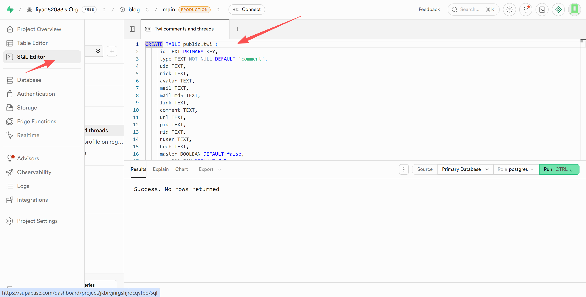

# Twikoo EdgeOne Pages 版本

<a href="https://twikoo.js.org/"></a>

[](./LICENSE)

专为腾讯云 EdgeOne Pages 平台优化的 [Twikoo](https://github.com/twikoojs/twikoo) 评论系统后端。

镜像仓库: [CNB](https://cnb.cool/Mintimate/code-nest/twikoo-eo)、[GitHub](https://github.com/Mintimate/twikoo-eo)

**简洁** · **安全** · **免费**

## 特性

- 基于 EdgeOne Pages 边缘计算，全球加速
- 使用 Supabase PostgreSQL 数据库，数据持久化存储
- 支持多种图床上传（GitHub、S3、兰空图床等）
- 支持人工审核模式，所有评论需管理员审核后显示
- 支持邮件通知、即时消息推送
- 一键部署，开箱即用

## 快速上手 | Quick Start

### 一键部署 | One-Click Deploy

直接点击此按钮一键部署：

[](https://console.cloud.tencent.com/edgeone/pages/new?repository-url=https://github.com/liyao52033/twikoo-eo/tree/supabase)

查看 [腾讯云 EdgeOne Pages 文档](https://cloud.tencent.com/document/product/1552/127366) 了解更多详情。

### 完整教程

#### 部署步骤 | Deployment Steps

1. **准备工作**
   - 注册腾讯云账号并开通 EdgeOne 服务
   - 注册 [Supabase](https://supabase.com) 账号并创建项目

2. **创建 Supabase 数据库表**
   - 在 Supabase 项目中创建名为 `twikoo` 的表
   - 表结构包含以下字段：

   | 字段名 | 类型 | 说明 |
   |--------|------|------|
   | `id` | text | 主键，记录唯一标识（Twikoo 生成的去掉横线的 UUID） |
   | `type` | text | 记录类型：`'comment'` 评论 / `'config'` 配置 / `'counter'` 计数器 |
   | `uid` | text | 用户唯一标识（`md5(nick + mail)`，用于识别用户身份和审核中评论归属） |
   | `nick` | text | 评论者昵称（仅评论类型） |
   | `avatar` | text | 评论者头像 URL（仅评论类型） |
   | `mail` | text | 评论者邮箱（加密存储，仅评论类型） |
   | `mail_md5` | text | 邮箱 MD5 值（仅评论类型） |
   | `link` | text | 评论者网站链接（仅评论类型） |
   | `comment` | text | 评论内容（仅评论类型） |
   | `url` | text | 评论所在页面 URL / 计数器页面 URL |
   | `pid` | text | 父评论 ID（回复功能，仅评论类型） |
   | `rid` | text | 根评论 ID（楼中楼功能，仅评论类型） |
   | `ruser` | text | 被回复者昵称（回复功能，仅评论类型） |
   | `href` | text | 评论页面完整 URL（仅评论类型） |
   | `master` | boolean | 是否为博主评论（仅评论类型） |
   | `top` | boolean | 是否置顶（仅评论类型） |
   | `is_spam` | boolean | 是否为垃圾评论/待审核（仅评论类型） |
   | `likes` | jsonb | 点赞用户列表（仅评论类型） |
   | `ip` | text | 评论者 IP 地址（仅评论类型） |
   | `ua` | text | 评论者 User-Agent（仅评论类型） |
   | `config` | jsonb | 系统配置数据（仅配置类型） |
   | `title` | text | 页面标题（仅计数器类型） |
   | `count` | integer | 访问计数（仅计数器类型） |
   | `created` | timestamp | 记录创建时间 |
   | `updated` | timestamp | 记录更新时间 |

   **记录类型说明：**
   - **`type = 'comment'`**：存储用户评论数据
   - **`type = 'config'`**：存储 Twikoo 管理后台的配置（如 SMTP、图床、反垃圾等设置），首次保存配置时自动创建
   - **`type = 'counter'`**：存储文章/页面访问计数

   <br />

   - 使用以下 SQL 在 SQL Editor 中创建表：
   

   ```sql
   CREATE TABLE public.twikoo (
     id TEXT PRIMARY KEY,
     type TEXT NOT NULL DEFAULT 'comment',
     uid TEXT,
     nick TEXT,
     avatar TEXT,
     mail TEXT,
     mail_md5 TEXT,
     link TEXT,
     comment TEXT,
     url TEXT,
     pid TEXT,
     rid TEXT,
     ruser TEXT,
     href TEXT,
     master BOOLEAN DEFAULT false,
     top BOOLEAN DEFAULT false,
     is_spam BOOLEAN DEFAULT false,
     likes JSONB DEFAULT '[]',
     ip TEXT,
     ua TEXT,
     config JSONB,
     title TEXT,
     count INTEGER DEFAULT 0,
     created TIMESTAMP WITH TIME ZONE DEFAULT NOW(),
     updated TIMESTAMP WITH TIME ZONE DEFAULT NOW()
   );
   -- 创建索引以提高查询性能
   CREATE INDEX idx_twikoo_url ON twikoo(url);
   CREATE INDEX idx_twikoo_rid ON twikoo(rid);
   CREATE INDEX idx_twikoo_pid ON twikoo(pid);
   CREATE INDEX idx_twikoo_type ON twikoo(type);
   CREATE INDEX idx_twikoo_uid ON twikoo(uid);
   CREATE INDEX idx_twikoo_is_spam ON twikoo(is_spam);
   ```

   - 为 `twikoo` 表添加行级安全策略
   
   ```sql
   -- ======================================
   -- 批次1：基础准备（清理旧策略+启用RLS）
   -- ======================================
   -- 1. 启用RLS并强制所有者遵守
   ALTER TABLE public.twikoo ENABLE ROW LEVEL SECURITY;
   ALTER TABLE public.twikoo FORCE ROW LEVEL SECURITY;
   
   -- 2. 删除所有旧策略（避免冲突）
   DROP POLICY IF EXISTS twikoo_admin_select_all ON public.twikoo;
   DROP POLICY IF EXISTS twikoo_public_select_non_spam ON public.twikoo;
   DROP POLICY IF EXISTS twikoo_own_select_non_spam ON public.twikoo;
   DROP POLICY IF EXISTS twikoo_deny_delete_config ON public.twikoo;
   DROP POLICY IF EXISTS twikoo_admin_all_write ON public.twikoo;
   DROP POLICY IF EXISTS twikoo_own_update_non_spam ON public.twikoo;
   DROP POLICY IF EXISTS twikoo_select_policy ON public.twikoo;
   DROP POLICY IF EXISTS twikoo_admin_insert ON public.twikoo;
   DROP POLICY IF EXISTS twikoo_admin_update ON public.twikoo;
   DROP POLICY IF EXISTS twikoo_admin_delete ON public.twikoo;
   
   -- ======================================
   -- 批次2：创建核心辅助函数
   -- ======================================
   -- 管理员判断函数（已存在则覆盖）
   CREATE OR REPLACE FUNCTION is_admin()
   RETURNS boolean AS $$
   BEGIN
       RETURN current_setting('app.is_admin', true)::boolean = true;
   END;
   $$ LANGUAGE plpgsql SECURITY DEFINER;
   
   -- 当前用户UID函数（已存在则覆盖）
   CREATE OR REPLACE FUNCTION current_user_uid()
   RETURNS text AS $$
   BEGIN
       RETURN current_setting('app.current_user_uid', true)::text;
   END;
   $$ LANGUAGE plpgsql;
   
   -- ======================================
   -- 批次3：创建所有RLS策略（核心，修正INSERT语法）
   -- ======================================
   -- 核心SELECT策略（管理员看所有，普通用户看公开+自己的审核中的评论）
   CREATE POLICY twikoo_select_policy ON public.twikoo
       FOR SELECT
       USING (
           is_admin()
           OR (is_spam = false)
           OR (is_spam = true AND uid = current_user_uid())
       );
   
   -- 禁止删除type=config的行（DELETE用USING）
   CREATE POLICY twikoo_deny_delete_config ON public.twikoo
       FOR DELETE
       USING (type <> 'config');
   
   -- 管理员INSERT策略（修正：INSERT用WITH CHECK）
   CREATE POLICY twikoo_admin_insert ON public.twikoo
       FOR INSERT
       WITH CHECK (is_admin());
   
   -- 管理员UPDATE策略（UPDATE可同时用USING+WITH CHECK，这里简化为WITH CHECK）
   CREATE POLICY twikoo_admin_update ON public.twikoo
       FOR UPDATE
       WITH CHECK (is_admin());
   
   -- 管理员DELETE策略（DELETE用USING）
   CREATE POLICY twikoo_admin_delete ON public.twikoo
       FOR DELETE
       USING (is_admin());
   
   -- ======================================
   -- 批次4：赋予基础权限（替换为你的实际用户名）
   -- ======================================
   
   -- 确保所有用户能看公开评论
   GRANT SELECT ON public.twikoo TO public;
   ```
   
3. **创建 EdgeOne Pages 项目**
   - 登录腾讯云 EdgeOne 控制台
   - 创建新的 Pages 项目
   - 选择 GitHub 作为代码源
   - 关联本仓库。或者直接下载本仓库，手动上传到 EdgeOne Pages 里（会自动触发部署）。

4. **配置环境变量**
   在 EdgeOne Pages 控制台添加以下环境变量：
   
   | 变量名 | 说明 | 是否必填 |
   |--------|------|----------|
   | `SUPABASE_URL` | Supabase 项目 URL | 是 |
   | `SUPABASE_SERVICE_ROLE_KEY` | Supabase 服务角色密钥 | 是 |
   | `CORS_ALLOW_ORIGIN` | 允许的跨域域名 | 否 |

   - `SUPABASE_URL` 和 `SUPABASE_SERVICE_ROLE_KEY` 可在 Supabase 项目设置 > API 中获取
   - `CORS_ALLOW_ORIGIN` 格式：`example.com,blog.example.com`（多个域名用逗号分隔），不设置则允许所有域名访问

5. **触发部署**
   - 三种方法触发部署: 
     1. Fork 代码到自己仓库，EdgeOne Pages 进行关联，后续会自动触发部署
     2. 直接本地安装 edgeone-cli 情况下，`edgeone pages link`、`edgeone pages deploy`部署
     3. 手动上传代码到 EdgeOne Pages 里覆盖
   - 部署完成后，获取你的 EdgeOne Pages 地址作为 twikoo 的环境配置

6. **前端配置**
   ```html
   <script>
     twikoo.init({
       envId: 'your-edgeone-pages-url',  // EdgeOne Pages 地址
       el: '#tcomment'
     })
   </script>
   ```

#### 环境配置要求 | Environment Requirements

- **Node.js**: 18+ (EdgeOne Pages 自动提供)
- **Supabase**: 需要创建项目并配置数据库表

---

## 自定义功能说明 | Custom Features

本版本针对 EdgeOne Pages 平台进行了多项自定义实现，以下是各功能的详细说明及自定义原因。

### 图床配置 | Image Hosting

**为什么需要自定义图床功能？**

原 Twikoo 的图床功能主要面向腾讯云云开发环境，而 EdgeOne Pages 是一个边缘计算平台，部分原生的图床适配无法直接使用。本版本重新实现了图片上传功能，支持更多图床选项，并针对 EdgeOne 环境进行了优化。

**主要改进：**
- 支持后端上传图片到多种图床（原版本部分图床仅支持前端上传）
- 新增对 Picgo、Github、s3兼容 等图床的支持
- 使用原生 `fetch` API 替代平台特定的 SDK，提高兼容性

本版本支持多种图床上传方式，可在 Twikoo 管理后台的「插件」中配置。

#### 支持的图床列表

| 图床 | IMAGE_CDN | IMAGE_CDN_URL | IMAGE_CDN_TOKEN | 说明 |
|------|-----------|---------------|-----------------|------|
| 腾讯云 COS | `qcloud` | ✅ | - | 使用 S3 兼容 API 上传 |
| 7bu 图床 | `7bu` | - | ✅ | https://7bu.top |
| SM.MS | `smms` | - | ✅ | https://smms.app |
| 兰空图床 | `lskypro` | ✅ | ✅ | Lsky Pro v2 |
| PicList | `piclist` | ✅ | 可选 | 图床管理工具 |
| PicGo | `picgo` | ✅ | - | 图床管理工具 |
| GitHub | `github` | ✅ | ✅ | 使用 jsDelivr 加速 |
| S3 兼容 | `s3` | ✅ | ✅ | hi168/AWS/阿里云/腾讯云 |
| EasyImage | `easyimage` | ✅ | ✅ | EasyImage 2.0 |
| 自定义 | URL | - | 视情况 | 直接填写图床 URL |

#### 配置示例

**1. GitHub 图床**

| 配置项 | 值 |
|--------|-----|
| IMAGE_CDN | `github` |
| IMAGE_CDN_URL | `用户名/仓库名/分支/路径`<br>如: `myname/images/main/comments` |
| IMAGE_CDN_TOKEN | GitHub Personal Access Token<br>需勾选 `repo` 权限 |

Token 获取: https://github.com/settings/tokens

**2. S3 兼容存储 (hi168/AWS/阿里云 OSS/腾讯云 COS)**

| 配置项 | 值 |
|--------|-----|
| IMAGE_CDN | `s3` 或 `qcloud` |
| IMAGE_CDN_URL | `https://端点/桶名/区域/路径`<br>如: `https://s3.hi168.com/mybucket/us-east-1/picgo` |
| IMAGE_CDN_TOKEN | `AccessKeyId:SecretAccessKey` |

URL 格式说明:
```
https://s3.hi168.com/hi168-25202-9063qibb/us-east-1/picgo
|------- 端点 -------|---- 桶名 ----|--区域--|--路径-|
```

**3. PicGo / PicList**

| 配置项 | 值 |
|--------|-----|
| IMAGE_CDN | `picgo` 或 `piclist` |
| IMAGE_CDN_URL | `http://服务器IP:36677`<br>如: `http://localhost:36677` |
| IMAGE_CDN_TOKEN | PicList 密钥（可选） |

使用说明:
1. 安装 PicGo 或 PicList 软件
2. 配置好要使用的图床（GitHub、阿里云等）
3. 开启「PicGo-Server」或「PicList 上传服务」（默认端口 36677）
4. 确保服务器能访问 PicGo/PicList 所在机器

**4. 兰空图床 (Lsky Pro)**

| 配置项 | 值 |
|--------|-----|
| IMAGE_CDN | `lskypro` |
| IMAGE_CDN_URL | 图床地址<br>如: `https://lsky.example.com` |
| IMAGE_CDN_TOKEN | API Token |

**5. SM.MS 图床**

| 配置项 | 值 |
|--------|-----|
| IMAGE_CDN | `smms` |
| IMAGE_CDN_URL | - |
| IMAGE_CDN_TOKEN | SM.MS 的 API Token |

Token 获取: https://smms.app/home/apitoken

**6. EasyImage 2.0**

| 配置项 | 值 |
|--------|-----|
| IMAGE_CDN | `easyimage` |
| IMAGE_CDN_URL | API 地址<br>如: `https://img.example.com/api/index.php` |
| IMAGE_CDN_TOKEN | 图床 Token |

#### 注意事项

1. **Token 格式**: S3 兼容存储的 Token 格式为 `AccessKeyId:SecretAccessKey`（用冒号分隔）
2. **网络访问**: PicGo/PicList 需要确保 Twikoo 后端能访问到对应的服务地址
3. **GitHub 加速**: GitHub 图床默认使用 jsDelivr CDN 加速访问
4. **S3 签名**: 当前使用简化版 AWS Signature V4，如遇问题请反馈

---

### 人工审核模式 | Manual Review

**为什么需要自定义人工审核功能？**

原 Twikoo 依赖 Akismet 等第三方服务进行垃圾评论过滤，但在某些场景下：
1. 用户可能无法访问 Akismet 服务（网络限制）
2. 用户希望完全掌控评论审核流程
3. 需要更灵活的审核策略

本版本新增了 `MANUAL_REVIEW` 模式，让所有评论都需要管理员手动审核后才能显示，不依赖任何外部反垃圾服务。

**主要改进：**
- 新增 `MANUAL_REVIEW` 配置选项，一键开启人工审核
- 评论提交后自动标记为待审核状态（仅管理员可见）
- 管理员可在后台统一审核、通过或删除评论

#### 如何开启

在 Twikoo 管理后台的「反垃圾」配置中，将 **Akismet Key** 设置为 `MANUAL_REVIEW`：

| 配置项 | 值 |
|--------|-----|
| AKISMET_KEY | `MANUAL_REVIEW` |

#### 工作原理

1. 用户提交评论后，评论会被标记为 "垃圾评论"（仅管理员可见）
2. 管理员登录 Twikoo 管理后台，在「评论管理」中查看待审核评论
3. 管理员审核通过后，评论才会显示在前台
4. 审核拒绝的评论将被删除或保持隐藏状态

#### 与自动反垃圾的区别

| 模式 | AKISMET_KEY 值 | 说明 |
|------|----------------|------|
| 自动反垃圾 | 留空或填写 Akismet API Key | 使用 Akismet 服务自动检测垃圾评论 |
| 人工审核 | `MANUAL_REVIEW` | 所有评论都需要管理员手动审核 |
| 关闭反垃圾 | 留空且不配置其他反垃圾选项 | 所有评论直接显示，不经过审核 |

---

### 邮件通知服务 | Email Notification

**为什么需要自定义邮件功能？**

原 Twikoo 主要依赖传统 SMTP 协议发送邮件，但在 EdgeOne Pages 等边缘计算环境中：
1. 部分 SMTP 端口可能被限制
2. 需要更可靠的邮件发送服务
3. 现代邮件服务（如 SendGrid、Resend）提供更简单的 API 集成

本版本重新实现了邮件发送功能，优先支持基于 HTTP API 的邮件服务，提高兼容性和可靠性。

**主要改进：**
- 支持 SendGrid API（推荐，免费额度充足）
- 支持 MailChannels API（适合已有账号的用户）
- 其他 SMTP 服务通过 Resend 中转（简化配置）
- 使用原生 `fetch` API 发送邮件，无需额外 SMTP 依赖

本版本支持多种邮件发送方式：

| 邮件服务 | SMTP_SERVICE | SMTP_PASS | 说明 |
|----------|--------------|-----------|------|
| SendGrid | `SendGrid` | SendGrid API Key | 推荐，稳定可靠 |
| MailChannels | `mailchannels` | MailChannels API Key | 需要申请 MailChannels 账号 |
| 其他服务 | 任意 | Resend API Key | 通过 Resend 发送 |

推荐使用 **SendGrid** 或 **Resend** 作为邮件服务提供商。

---

## 常见问题解决方法 | Common Issues

1. **Supabase 连接失败**
   - 检查 `SUPABASE_URL` 和 `SUPABASE_SERVICE_ROLE_KEY` 是否正确配置
   - 确认 Supabase 项目是否正常运行
   - 检查 Supabase 数据库表是否已创建

2. **邮件通知不工作**
   - 验证 SMTP 服务配置是否正确
   - 检查邮箱是否开启了 IMAP/SMTP 服务
   - 确认邮箱密码或 API 密钥是否正确

3. **评论提交失败**
   - 检查网络连接和 EdgeOne Pages 地址
   - 查看 EdgeOne Pages 部署日志排查错误
   - 确认 Supabase 数据库连接正常

4. **图片上传失败**
   - 检查图床配置是否正确
   - 确认图床 Token 是否有效
   - 检查图床服务是否可访问

---

## 开发 | Development

### EdgeOne Pages 开发 | EdgeOne Pages Development

本项目结构专为 EdgeOne Pages 平台优化：

``` sh
# 安装 EdgeOne CLI (在 CloudStudio 中已预装)
npm install -g edgeone

# 本地开发调试
edgeone pages dev

# 项目检查
node build.cjs
```

**项目结构说明：**
```
├── node-functions/
│   ├── index.js               # Node Function 主入口（处理评论逻辑）
│   ├── ip2region-searcher.js  # IP 归属地查询器（纯内存实现）
│   ├── ip2region-data.js      # IP 数据库（构建时自动生成）
│   └── logger.js              # 日志记录工具
├── package.json               # 项目依赖配置
├── build.cjs                  # 构建检查脚本
└── .cnb.yml                   # CNB 环境配置（可选）
```

**架构说明：**
- **Node Function (`node-functions/index.js`)**: 运行在 Node.js 环境，处理评论业务逻辑、邮件通知等
- **数据库**: 使用 Supabase PostgreSQL 数据库存储评论数据
- **自定义功能**:
  - 多种图床上传支持（GitHub、S3、兰空图床等）
  - 人工审核模式（AKISMET_KEY = MANUAL_REVIEW）
  - IP 归属地查询（纯内存实现，无需外部 API）

### IP 归属地查询 | IP Region Lookup

**为什么需要自定义 IP 归属地查询？**

原 Twikoo 依赖外部 IP 查询 API 服务，但这会带来以下问题：
1. 外部 API 可能有调用频率限制或收费
2. 网络延迟影响评论提交速度
3. 依赖第三方服务的稳定性

本版本使用 `ip2region` 数据库，将 IP 归属地查询功能完全本地化：
- **纯内存查询**：无需网络请求，响应速度极快
- **离线可用**：不依赖任何外部 API 服务
- **数据完整**：支持全球 IP 归属地查询
- **自动构建**：IP 数据库在构建时自动生成

**实现文件：**
- `ip2region-searcher.js`: IP 查询核心逻辑（基于内存的二分查找）
- `ip2region-data.js`: IP 数据库（构建时从 ip2region 项目生成）

**开发注意事项：**
- 环境变量在 EdgeOne Pages 控制台配置
- 本地开发时需要配置 `.env` 文件或环境变量
- 修改代码后需要重新部署才能生效

如果您的改动能够帮助到更多人，欢迎提交 Pull Request！

---

## 许可 | License

<details>
<summary>MIT License</summary>

[](https://app.fossa.com/projects/git%2Bgithub.com%2Fimaegoo%2Ftwikoo?ref=badge_large)

</details>
